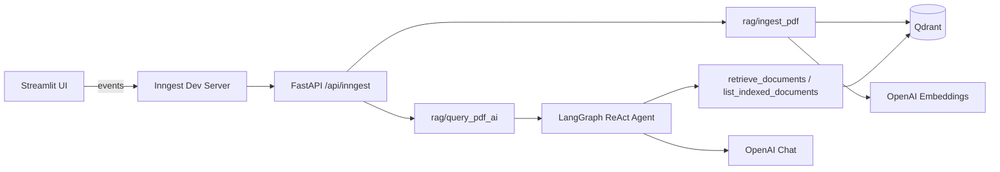

# RAG AI Agent

A document Q&A application that ingests PDFs into a vector database and answers questions with a LangGraph ReAct agent. A Streamlit UI handles uploads and chat; [Inngest](https://www.inngest.com/) runs ingestion and query workflows on a FastAPI backend.

## Features

- **PDF ingestion** — Upload PDFs, chunk text (LlamaIndex `SentenceSplitter`), embed with OpenAI `text-embedding-3-large`, and store vectors in Qdrant.
- **Agentic retrieval** — A LangGraph agent (`gpt-4o-mini`) chooses when to search the knowledge base or list indexed documents.
- **Grounded answers** — Responses cite source filenames; the UI shows retrieved chunks and sources.
- **Conversation memory** — Per-thread checkpoints via LangGraph `MemorySaver` (aligned with chat session IDs in the UI).
- **Knowledge base management** — View, delete per-document, or clear all indexed content from the sidebar.

## Architecture




| Component          | Role                                                                          |
| ------------------ | ----------------------------------------------------------------------------- |
| `streamlit_app.py` | Chat UI, PDF upload, document list; sends Inngest events and polls run output |
| `main.py`          | FastAPI app and Inngest functions (`RAG: Ingest PDF`, `RAG: Query PDF`)       |
| `rag_agent.py`     | LangGraph ReAct agent and answer/source extraction                            |
| `tools.py`         | Agent tools wrapping vector search and source listing                         |
| `data_loader.py`   | PDF read, chunk, embed                                                        |
| `vector_db.py`     | Qdrant collection lifecycle, search, delete                                   |


## Prerequisites

- Python 3.11+ (project tested with 3.13)
- [Docker](https://www.docker.com/) (recommended for Qdrant)
- [OpenAI API key](https://platform.openai.com/api-keys)
- [Inngest CLI](https://www.inngest.com/docs/local-development) for local dev (or `npx inngest-cli@latest`)

## Setup

### 1. Clone and install dependencies

```bash
cd rag-ai-agent-plan
python -m venv venv
source venv/bin/activate   
pip install -r requirements.txt
```

### 2. Environment variables

Create a `.env` file in the project root:

```env
OPENAI_API_KEY=your_openai_api_key
```

Optional:

```env
INNGEST_API_BASE=http://127.0.0.1:8288/v1
```

The Streamlit app uses `INNGEST_API_BASE` when polling Inngest run status (default: `http://127.0.0.1:8288/v1`).

### 3. Start Qdrant

Qdrant must be reachable at `http://localhost:6333` (see `vector_db.py`). Create a qdrant_storage folder first. 

```bash
docker run -d --name qdrantdb -p 6333:6333 -v "./qdrant_storage:/qdrant/storage" qdrant/qdrant
```

The app creates a `docs` collection automatically (3072-dimensional cosine vectors).

### 4. Start the API and Inngest

Terminal 1 — FastAPI + Inngest handler:

```bash
source venv/bin/activate
uvicorn main:app --reload --host 127.0.0.1 --port 8000
```

Terminal 2 — Inngest dev server (points at your app’s Inngest endpoint):

```bash
npx inngest-cli@latest dev -u http://127.0.0.1:8000/api/inngest --no-discovery
```

### 5. Start the Streamlit UI

Terminal 3:

```bash
streamlit run streamlit_app.py
```

Open the URL Streamlit prints (typically `http://localhost:8501`).

## Usage

1. In the sidebar, upload a PDF. The app saves it under `uploads/` and triggers a `rag/ingest_pdf` event.
2. Wait for indexing to finish (success message in the sidebar).
3. Ask questions in the chat. Each message triggers `rag/query_pdf_ai`; the agent retrieves relevant chunks and replies with citations.
4. Use **Conversations** in the sidebar to start or switch threads (each maps to an agent `thread_id`).
5. Remove individual documents or **Clear All** to reset the Qdrant collection.

## Inngest events


| Event              | Payload                                   | Function                                                                 |
| ------------------ | ----------------------------------------- | ------------------------------------------------------------------------ |
| `rag/ingest_pdf`   | `pdf_path`, optional `source_id`          | Load PDF → chunk → embed → upsert to Qdrant                              |
| `rag/query_pdf_ai` | `question`, optional `top_k`, `thread_id` | Run ReAct agent and return `answer`, `sources`, `chunks`, `num_contexts` |


You can also send these events from the Inngest dashboard or your own client while the dev server and API are running.

## Project layout

```
.
├── main.py              # FastAPI + Inngest functions
├── streamlit_app.py     # Web UI
├── rag_agent.py         # LangGraph agent
├── tools.py             # Retrieval tools
├── data_loader.py       # PDF + embeddings
├── vector_db.py         # Qdrant client wrapper
├── models.py            # Pydantic models for Inngest steps
├── uploads/             # Uploaded PDFs (created at runtime)
└── qdrant_storage/      # Optional local Qdrant data (gitignored)
```

## Configuration notes

- **Embeddings:** `text-embedding-3-large` (3072 dimensions) in `data_loader.py`.
- **Chat model:** `gpt-4o-mini` in `rag_agent.py`.
- **Chunking:** 1000 characters with 200 overlap in `data_loader.py`.
- **Default retrieval:** `top_k=5` unless overridden in the query event or agent prompt.

